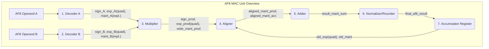

## 📄 實作方案：AetherFloat-8 (AF8) MAC 單元

### 1. 設計目標與背景

本方案旨在實作一個針對AI推理優化的AF8 MAC單元，透過結構創新實現顯著的面積和能效提升。

*   **目標**：實作論文中描述的AetherFloat-8格式的MAC單元。
*   **基線格式**：遵循Morisaki的論文"Block-Scale-Free Quad-Radix Floating-Point Architectures for AI Accelerators" 中定義的AF8格式。
*   **核心指標**：
    1.  **面積與功耗優化**：相比傳統FP8 MAC，實現 **33.17%** 的面積和 **21.99%** 的總功耗降低。
    2.  **無AMAX邏輯**：透過擴大動態範圍，實現"Block-Scale-Free"推理，完全省去AMAX計算硬體。
    3.  **簡化控制**：實現"無分支"的次正規數處理路徑。

### 2. 頂層架構與資料流

AF8 MAC的頂層模組劃分與FP8類似，但內部邏輯極大簡化。下圖展示了關鍵差異點：

### 3. 詳細模組設計與實作步驟（與FP8的差異點）

#### 步驟1：解碼器

**功能**：解碼AF8格式，相比FP8有本質區別。

| 特性 | FP8 解碼器 | **AF8 解碼器** |
| :--- | :--- | :--- |
| **編碼** | `sign` `exp` `mant` | `sign` `exp` `mant` |
| **隱藏位** | 有 (`1` or `0`) | **無 (顯式尾數)** |
| **尾數寬度** | 3 bits -> 4 bits | **3 bits -> 3 bits** (不變) |
| **指數基** | 2 (`2^E`) | **4 (`4^E`)** |
| **指數位寬** | `E` 為 4 bits | **`E` 為 4 bits** (不變) |
| **指數計算** | `actual_exp = E - 7` | **`actual_exp = 2 * (E - 7)`** |
| **次正規數處理** | `if (E==0) hidden=0` | **無分支，`M∈{0,1}`直接作為尾數** |

#### 步驟2：乘法器

*   **Sign**：`sign_prod = sign_A XOR sign_B`
*   **Exponent**：`exp_prod = 2*(exp_A + exp_B - 7)`。注意，AF8中指數以4為基，因此實際指數差為2倍。
*   **Mantissa**：`mant_prod_full = mant_A_explicit * mant_B_explicit`
    *   `mant_A_explicit` 和 `mant_B_explicit` 均為 3 bits，需要一個 **3x3 乘法器**，產生 **6-bit** 乘積。
    *   **這是 AF8 面積縮減的關鍵來源。**

#### 步驟3：新型對齊器

*   **指數差計算**：`exp_diff = |exp_prod - exp_acc|`。由於指數現在以2為基表示（即 `actual_exp = 2*E`），其差值 `exp_diff` 必然是偶數。
*   **位移粒度**：移位量以 **2-bit 為粒度**（因 `4^1 = 2^2`）。
*   **實作**：**無需全功能 Barrel Shifter**。只需一個**由MUX樹實作的2-bit多路移位器**，從根本上節省了面積和延遲。

#### 步驟4：加法器

*   此部分與FP8累加器設計邏輯相似，可使用32-bit累加器以確保精度。但輸入的運算元位寬更小。

#### 步驟5：簡化正規化器與次正規數

*   **正規化**：由於指數步進為2，且尾數是顯式的，前導零的檢測和處理邏輯可以簡化。
*   **"One-step" 次正規數處理**：
    *   當運算結果的指數 `<= 0` 時，進入次正規數路徑。
    *   AF8支援的次正規數只有 `M=0b001` 和 `M=0b000` 兩種形式，因此硬體只需判斷結果是否非零，並直接設定尾數為 `1` 或 `0`。
    *   **無複雜的多級移位或優先權編碼器，真正實現了“無分支”邏輯。**

#### 步驟6：累加器暫存器

*   由於AF8的指數是Quad-Radix格式，累加器中儲存的指數也需相應調整，但在MAC單元內部，可使用統一的高精度定指數格式。

### 4. 關鍵技術細節與邊界條件（Checklist）

*   ⚠️ **資料格式轉換**：當AF8資料進出MAC單元時，需特別處理指數基的轉換（`*2` 或 `/2`），確保與外部介面的相容性。
*   ⚠️ **尾數對齊**：在加法器前，必須確保將尾數對齊到與標準浮點加法器相容的位置，並考慮其顯式尾數的特殊性（最高位可能不是1）。
*   ⚠️ **測試驗證**：建立包含AF8特有邊界情況（如 `M=0`, `E=0`, `M=1, E=0`）的測試向量，驗證其"無分支"次正規數處理的正確性。
*   ⚠️ **功耗分析**：在進行功耗對比時，務必採用與論文一致的方法，使用典型的 **20% toggle rate**來生成測試激勵，以確保功耗資料與論文報導的 **21.99%** 有可比性。
*   ⚠️ **AMAX邏輯省略**：在最終的面積和功耗報告中，需明確聲明AF8的實作中**未包含任何AMAX計算電路**，而FP8 Baseline中也應將AMAX部分排除，以保證對比的公平性。

---

## 💡 關鍵差異與權衡分析（對照表）

下表是兩份實作方案中關鍵差異的系統性對比，參考了和等文獻。

| 特性 | FP8 E4M3 (Baseline) | AF8 (目標格式) | 硬體影響 (AF8 優勢) |
| :--- | :--- | :--- | :--- |
| **尾數類型** | 隱含位 + 3-bit 顯式 | 純 3-bit 顯式 | **節省1-bit解碼和MUX邏輯** |
| **乘法器陣列** | 4x4 bit | **3x3 bit** | **顯著降低面積和功耗** |
| **指數基** | Base-2 | **Base-4** | 對齊邏輯簡化 |
| **對齊器** | **全 Barrel Shifter** | **2-bit 粒度 MUX 樹** | **大幅減少面積和關鍵路徑延遲** |
| **次正規數處理** | **有分支，需 LZD** | **"One-step", 無分支** | **消除流水線停頓和控制邏輯** |
| **動態範圍** | ≈ 10⁻² 至 448 | ≈ **1.22×10⁻⁴ 至 57,344** | **無需 AMAX 硬體單元** |
| **AMAX (Block-Scaling)** | **必需** (面積代價大) | **不需要** | **消除整個AMAX模組** |
| **整數可比性** | 否，需要FPU比較器 | **是，原生整數比較器** | **消除FP專用的比較邏輯** |