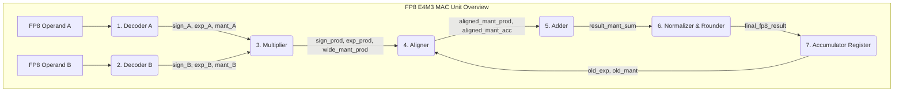

## 📄 實作方案：FP8 E4M3 Baseline MAC 單元

### 1. 設計目標與背景

本方案旨在構建一個傳統的FP8 MAC單元，作為效能對比的Baseline。

*   **目標**：實作一個支援FP8 E4M3格式的乘積累加單元。
*   **基線格式**：嚴格遵循行業聯合規範 `arXiv:2209.05433` (Micikevicius et al., 2022) 定義的FP8 E4M3格式。
*   **核心指標**：最大化動態範圍與精度平衡；包含完整的次正規數處理邏輯以支援漸進式下溢，但這會引入額外的硬體開銷。不包含複雜的動態縮放（AMAX）邏輯。

### 2. 頂層架構與資料流

FP8 E4M3 MAC單元遵循經典的浮點乘加流水線，其頂層架構概覽如下：

其關鍵路徑通常出現在**乘法器**、**對齊器**和**加法器/正規化器**上。詳細的時序特性評估可以參考。

### 3. 詳細模組設計與實作步驟

#### 步驟1：運算元解碼器

**功能**：將8位元輸入解碼為符號、指數和尾數的內部表示。

*   **Format**：1-bit 符號(S), 4-bit 指數(E), 3-bit 尾數(M)。
*   **Bias**：指數偏置值為 7。
*   **Hidden Bit**：
    *   `E > 0`: 隱藏位為 `1`，尾數為 `{1, M}` (4 bits)。
    *   `E = 0`: 隱藏位為 `0`，尾數為 `{0, M}` (4 bits)。**這是硬體複雜度的主要來源。**
*   **特殊值處理**：
    *   **NaN**：`E=15, M!=0`。論文中提到，`E4M3` 格式有唯一一個 NaN 值。
    *   **Infinity**：FP8 E4M3格式**不支援無窮大**，若出現 `E=15, M=0`，應視為 NaN 處理。

#### 步驟2：乘法器

**功能**：計算兩個FP8運算元的乘積。

*   **Sign**: `sign_prod = sign_A XOR sign_B`
*   **Exponent**: `exp_prod = exp_A + exp_B - 7 (bias)`
*   **Mantissa**: `mant_prod_full = mant_A_full * mant_B_full`
    *   `mant_A_full` 和 `mant_B_full` 均為 4 bits，需要一個 **4x4 乘法器**，產生 **8-bit** 乘積。
    *   乘積的尾數可能存在前導零。

#### 步驟3：對齊器

**功能**：為了加法，將乘積與累加器中的值對齊到同一指數階。

*   **指數比較**：計算 `exp_diff = exp_prod - exp_acc`。
*   **移位**：若 `exp_diff > 0`，需將 `mant_acc` 向右移 `exp_diff` 位，以匹配 `exp_prod`。反之亦然。
*   **實作**：需要 **全功能Barrel Shifter** 來處理可能的任意位移量，這是晶片面積和功耗開銷的主要來源之一。

#### 步驟4：加法器（✅ 已實作）

**檔案**：`FP8_MAC/01_RTL/FP8_MAC.sv` 模組 `fp8_adder`
**詳細文件**：`docs/FP8_MAC/01_Adder.md`

**功能**：對對齊後的尾數進行有號加法/減法運算。

*   **介面**：
    *   Input: `sign_a`, `sign_b`, `mant_a[MANT_WIDTH-1:0]`, `mant_b[MANT_WIDTH-1:0]`, `exp_common[7:0]`
    *   Output: `sign_out`, `mant_out[MANT_WIDTH:0]`（+1 bit 進位）, `exp_out[7:0]`
*   **操作選擇**：
    *   同號 (`sign_a == sign_b`)：`mant_out = mant_a + mant_b`，`sign_out = sign_a`
    *   異號 (`sign_a != sign_b`)：比較大小後大減小，`sign_out` 跟隨較大者
*   **指數**：`exp_out = exp_common`（pass through，指數調整交由 Normalizer）
*   **設計關鍵**：大減小保證 mant_out 恆為正，Normalizer 僅需單向 LZD
*   **累加器格式**：內部累加器（Accumulator）使用 **FP32 尾數精度**（24-bit + 4 guard bits，`MANT_WIDTH = 28`）

#### 步驟5：正規化與捨入器（✅ 已實作）

**檔案**：`FP8_MAC/01_RTL/FP8_MAC.sv` 模組 `fp8_normalizer`
**詳細文件**：`docs/FP8_MAC/02_Normalizer.md`

**功能**：將加法結果正規化並捨入為最終的 FP8 E4M3 輸出，同時輸出 FP32 精度值給累加器。

*   **介面**：
    *   Input: `sign_in`, `mant_in[MANT_WIDTH:0]`, `exp_in[7:0]`
    *   Output: `fp8_out[7:0]`（FP8 E4M3）, `acc_sign`, `acc_exp[7:0]`, `acc_mant[MANT_WIDTH-1:0]`
*   **三級組合邏輯**：
    1.  **Carry Adjustment**：處理加法溢位（右移 1 bit，指數 +1）
    2.  **LZD + 左移正規化**：前導零檢測後左移，若指數預算不足則部分正規化（`exp_norm = 0`）
    3.  **RNE 捨入 + FP8 封裝**：三條路徑 — Zero / Normal / Subnormal
*   **Normal 路徑**（`exp_norm >= 1`）：從 mantissa 擷取 `G, R, S` 做 RNE 捨入至 3-bit mantissa，溢位則輸出 NaN
*   **Subnormal 路徑**（`exp_norm == 0`）：`M_sub = mant_norm >> (MANT_WIDTH - 3)`，再做 RNE 捨入；若 `M_sub >= 8` 則升為最小 Normal
*   **RNE 公式**：`round = G & (R | S | LSB)`
*   **NaN 編碼**：`{sign, 4'b1111, 3'b100}`

#### 步驟6：累加器暫存器（✅ 已實作）

**檔案**：`FP8_MAC/01_RTL/FP8_MAC.sv` 模組 `fp8_acc_register`
**詳細文件**：`docs/FP8_MAC/03_Accumulator_Register.md`

**功能**：儲存 Normalizer 輸出的正規化結果，回饋給 Aligner 供下一個 MAC 週期使用。

*   **介面**：
    *   Input: `clk`, `rst_n`（async, active-low）, `acc_sign_in`, `acc_exp_in[7:0]`, `acc_mant_in[MANT_WIDTH-1:0]`
    *   Output: `acc_sign_out`, `acc_exp_out[7:0]`, `acc_mant_out[MANT_WIDTH-1:0]`
*   **重置**：`rst_n = 0` 時清除為零（初值 = 0，確保首次 MAC 累加項為 0）
*   **時序**：每個 `posedge clk` latch Normalizer 輸出，為 MAC 管線的唯一 pipeline register
*   **內部格式**：sign (1) + exp (8, bias=7) + mant (MANT_WIDTH, 含 hidden bit)

### 4. 關鍵技術細節與邊界條件（Checklist）

*   ⚠️ **浮點流水線結構**：確定要實作的 MAC 單元是**單週期**還是**多週期流水線**。多週期流水線需處理RAW（讀後寫）資料衝突。
*   ⚠️ **規格一致性**：驗證你的 encoder/decoder 邏輯是否嚴格遵守了 E4M3 的編碼表，特別是對特殊值（NaN, Subnormals）的處理。
*   ⚠️ **測試驗證**：建立一套全面的測試向量，涵蓋正常值、最大/最小正常值、次正規數、零、NaN等所有邊界情況，確保你的硬體與IEEE 754E4M3參考模型的行為完全一致。

## 💡 關鍵差異與權衡分析（對照表）

下表是兩份實作方案中關鍵差異的系統性對比，參考了和等文獻。

| 特性 | FP8 E4M3 (Baseline) | AF8 (目標格式) | 硬體影響 (AF8 優勢) |
| :--- | :--- | :--- | :--- |
| **尾數類型** | 隱含位 + 3-bit 顯式 | 純 3-bit 顯式 | **節省1-bit解碼和MUX邏輯** |
| **乘法器陣列** | 4x4 bit | **3x3 bit** | **顯著降低面積和功耗** |
| **指數基** | Base-2 | **Base-4** | 對齊邏輯簡化 |
| **對齊器** | **全 Barrel Shifter** | **2-bit 粒度 MUX 樹** | **大幅減少面積和關鍵路徑延遲** |
| **次正規數處理** | **有分支，需 LZD** | **"One-step", 無分支** | **消除流水線停頓和控制邏輯** |
| **動態範圍** | ≈ 10⁻² 至 448 | ≈ **1.22×10⁻⁴ 至 57,344** | **無需 AMAX 硬體單元** |
| **AMAX (Block-Scaling)** | **必需** (面積代價大) | **不需要** | **消除整個AMAX模組** |
| **整數可比性** | 否，需要FPU比較器 | **是，原生整數比較器** | **消除FP專用的比較邏輯** |