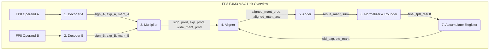

## 📄 實作方案：FP8 E4M3 Baseline MAC 單元

### 1. 設計目標與背景

本方案旨在構建一個傳統的FP8 MAC單元，作為效能對比的Baseline。

*   **目標**：實作一個支援FP8 E4M3格式的乘積累加單元。
*   **基線格式**：嚴格遵循行業聯合規範 `arXiv:2209.05433` (Micikevicius et al., 2022) 定義的FP8 E4M3格式。
*   **核心指標**：最大化動態範圍與精度平衡；包含完整的次正規數處理邏輯以支援漸進式下溢，但這會引入額外的硬體開銷。不包含複雜的動態縮放（AMAX）邏輯。

### 2. 頂層架構與資料流

FP8 E4M3 MAC單元遵循經典的浮點乘加流水線，其頂層架構概覽如下：

其關鍵路徑通常出現在**乘法器**、**對齊器**和**加法器/正規化器**上。詳細的時序特性評估可以參考。

### 3. 詳細模組設計與實作步驟

#### 步驟1：運算元解碼器

**功能**：將8位元輸入解碼為符號、指數和尾數的內部表示。

*   **Format**：1-bit 符號(S), 4-bit 指數(E), 3-bit 尾數(M)。
*   **Bias**：指數偏置值為 7。
*   **Hidden Bit**：
    *   `E > 0`: 隱藏位為 `1`，尾數為 `{1, M}` (4 bits)。
    *   `E = 0`: 隱藏位為 `0`，尾數為 `{0, M}` (4 bits)。**這是硬體複雜度的主要來源。**
*   **特殊值處理**：
    *   **NaN**：`E=15, M!=0`。論文中提到，`E4M3` 格式有唯一一個 NaN 值。
    *   **Infinity**：FP8 E4M3格式**不支援無窮大**，若出現 `E=15, M=0`，應視為 NaN 處理。

#### 步驟2：乘法器

**功能**：計算兩個FP8運算元的乘積。

*   **Sign**: `sign_prod = sign_A XOR sign_B`
*   **Exponent**: `exp_prod = exp_A + exp_B - 7 (bias)`
*   **Mantissa**: `mant_prod_full = mant_A_full * mant_B_full`
    *   `mant_A_full` 和 `mant_B_full` 均為 4 bits，需要一個 **4x4 乘法器**，產生 **8-bit** 乘積。
    *   乘積的尾數可能存在前導零。

#### 步驟3：對齊器

**功能**：為了加法，將乘積與累加器中的值對齊到同一指數階。

*   **指數比較**：計算 `exp_diff = exp_prod - exp_acc`。
*   **移位**：若 `exp_diff > 0`，需將 `mant_acc` 向右移 `exp_diff` 位，以匹配 `exp_prod`。反之亦然。
*   **實作**：需要 **全功能Barrel Shifter** 來處理可能的任意位移量，這是晶片面積和功耗開銷的主要來源之一。

#### 步驟4：加法器

**功能**：對對齊後的尾數進行加法/減法運算。

*   **操作選擇**：根據 `sign_prod` 和 `sign_acc` 判斷執行加法還是二進位補碼減法。
*   **累加器格式**：內部累加器（Accumulator）推薦使用 **FP32 格式**的超寬位寬，以防止點積運算中的精度損失和溢位。

#### 步驟5：正規化與捨入器

**功能**：將加法結果格式化為最終的FP8輸出。

*   **前導零檢測(LZD)**：對結果進行**前導零檢測**。如果存在前導零，則需將尾數左移，並相應減小指數。
*   **捨入**：採用 **捨入到最近偶數** 策略，以在多次運算中保持統計上的無偏性。
*   **次正規數輸出**：如果指數值 `<= 0`，則進入次正規數輸出邏輯，進行額外的移位和判斷。

#### 步驟6：累加器暫存器

*   儲存最新的求和結果（符號、指數、尾數）。累加器的復位值應為 0。

### 4. 關鍵技術細節與邊界條件（Checklist）

*   ⚠️ **浮點流水線結構**：確定要實作的 MAC 單元是**單週期**還是**多週期流水線**。多週期流水線需處理RAW（讀後寫）資料衝突。
*   ⚠️ **規格一致性**：驗證你的 encoder/decoder 邏輯是否嚴格遵守了 E4M3 的編碼表，特別是對特殊值（NaN, Subnormals）的處理。
*   ⚠️ **測試驗證**：建立一套全面的測試向量，涵蓋正常值、最大/最小正常值、次正規數、零、NaN等所有邊界情況，確保你的硬體與IEEE 754E4M3參考模型的行為完全一致。

## 💡 關鍵差異與權衡分析（對照表）

下表是兩份實作方案中關鍵差異的系統性對比，參考了和等文獻。

| 特性 | FP8 E4M3 (Baseline) | AF8 (目標格式) | 硬體影響 (AF8 優勢) |
| :--- | :--- | :--- | :--- |
| **尾數類型** | 隱含位 + 3-bit 顯式 | 純 3-bit 顯式 | **節省1-bit解碼和MUX邏輯** |
| **乘法器陣列** | 4x4 bit | **3x3 bit** | **顯著降低面積和功耗** |
| **指數基** | Base-2 | **Base-4** | 對齊邏輯簡化 |
| **對齊器** | **全 Barrel Shifter** | **2-bit 粒度 MUX 樹** | **大幅減少面積和關鍵路徑延遲** |
| **次正規數處理** | **有分支，需 LZD** | **"One-step", 無分支** | **消除流水線停頓和控制邏輯** |
| **動態範圍** | ≈ 10⁻² 至 448 | ≈ **1.22×10⁻⁴ 至 57,344** | **無需 AMAX 硬體單元** |
| **AMAX (Block-Scaling)** | **必需** (面積代價大) | **不需要** | **消除整個AMAX模組** |
| **整數可比性** | 否，需要FPU比較器 | **是，原生整數比較器** | **消除FP專用的比較邏輯** |